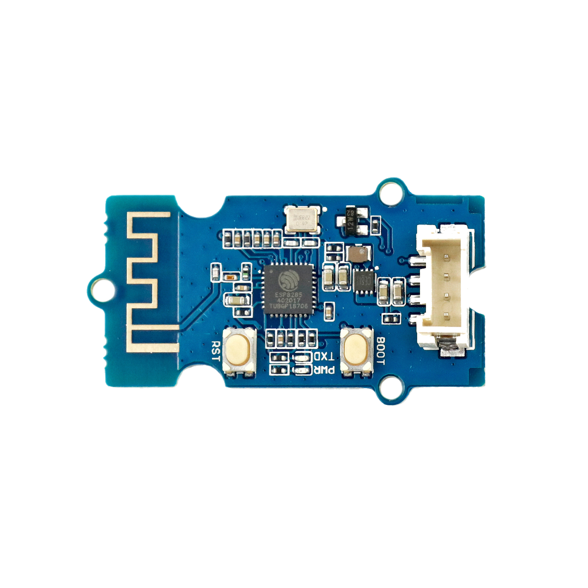

# WiFi-Modul

## Beschreibung
Das WiFi-Modul ermöglicht es Informationen, Befehle und Daten kabellos zwischen mehreren Endgeräten oder Mikrocontrollern innerhalb eines Netzwerkes zu übertragen. So lassen sich beispielsweise Sensordaten von einem Arduino in ein lokales Netzwerk stellen und damit an PCs oder Smartphones übertragen oder sogar über einen Router ins Internet stellen und von überall auf der Welt abrufen. Das Modul kann über bestimmte Befehle programmiert werden. So kann unter anderem das Modul selbst einen Zugangspunkt für andere Netzwerk-Clients darstellen oder sich in ein bestehendes WLAN einwählen. Das Modul kann direkt oder mithilfe des Grove Shields an einen Arduino oder Raspberry Pi über die serielle Schnittstelle UART angeschlossen werden.

Das WiFi-Modul ist eines der Grundsteine für alle vernetzte Projekte und Internet-of-Things-Projekte.

Alle weiteren Hintergrundinformationen sowie ein Beispielaufbau und alle notwendigen Programmbibliotheken sind auf dem offiziellen Wiki (bisher nur in englischer Sprache) von Seeed Studio zusammengefasst. Zusätzlich findet man über alle gängigen Suchmaschinen meist nur mit der Eingabe der genauen Komponenten-Bezeichnungen entsprechende Projektbeispiele und Tutorials.

Die genaue Bezeichnung des Moduls, die bei der Suche von Beschreibungen und Anleitungen wichtig sein kann, lautet ESP8266.

## Beispiele

!!!show-examples:./examples/

<!-- infolist -->

## Wichtige Links für die ersten Schritte:

- [Seeed Studio Wiki](http://wiki.seeedstudio.com/Grove-UART_Wifi/) [- WiFi](http://wiki.seeedstudio.com/Grove-UART_Wifi/)
- [Seeed Studio Youtube Kanal – Wirelessproducts comparison](https://www.youtube.com/watch?v=5hg0lllDTLk)
- [nl – Befehlsliste](https://nurdspace.nl/ESP8266)
- [GitHub – esp8266 Wiki](https://github.com/esp8266/esp8266-wiki/wiki)
- [ESP8266 Community Forum](https://www.esp8266.com/viewforum.php?f=25)

## Projektbeispiele:

- [msxfaq - ESP8266 Beispiel Projekte](https://www.msxfaq.de/sonst/bastelbude/esp8266/esp8266-projekte.htm)
- [GitHub – Demo Sketch](https://github.com/allthingstalk/arduino-UART-client/blob/master/libraries/ATT_IOT_UART/examples/genuino101/led/led.ino)
- [Instructables – Getting Started with ESP8285](https://www.instructables.com/id/How-to-Get-Started-With-ESP8285-Module-/)

## Weiterführende Hintergrundinformationen:

- [I2C - Wikipedia Artikel](https://de.wikipedia.org/wiki/I%C2%B2C)
- [SPI - Wikipedia Artikel](https://de.wikipedia.org/wiki/Serial_Peripheral_Interface)
- [UART - Wikipedia Artikel](https://de.wikipedia.org/wiki/Universal_Asynchronous_Receiver_Transmitter)
- [WiFi - Wikipedia Artikel](https://de.wikipedia.org/wiki/Wi-Fi)
- [Internet der Dinge](https://de.wikipedia.org/wiki/Internet_der_Dinge) [(IoT)](https://de.wikipedia.org/wiki/Internet_der_Dinge) [- Wikipedia Artikel](https://de.wikipedia.org/wiki/Internet_der_Dinge)
- [Access Point - Wikipedia Artikel](https://de.wikipedia.org/wiki/Wireless_Access_Point)
- [GitHub-Repository: WiFi-Modul](https://github.com/MakeYourSchool/54-Wifi-Modul)

